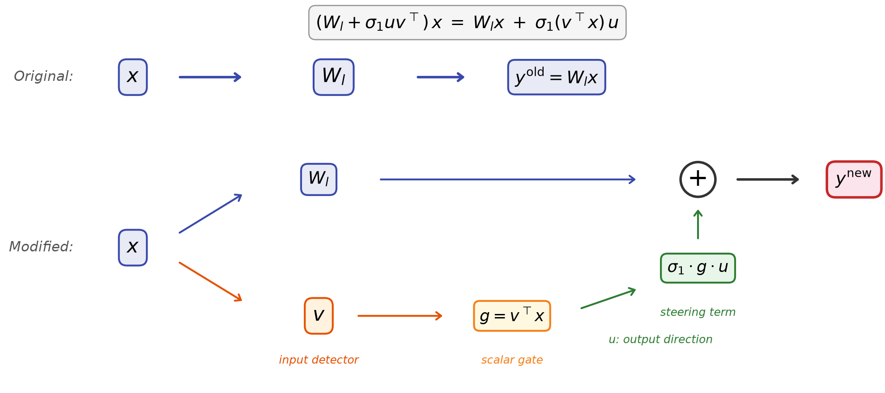
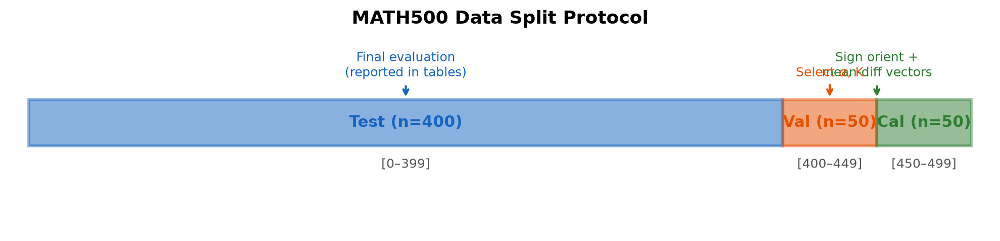
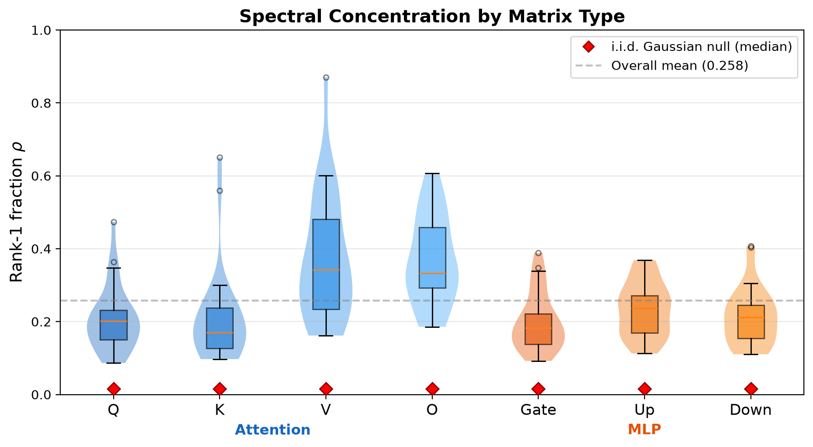
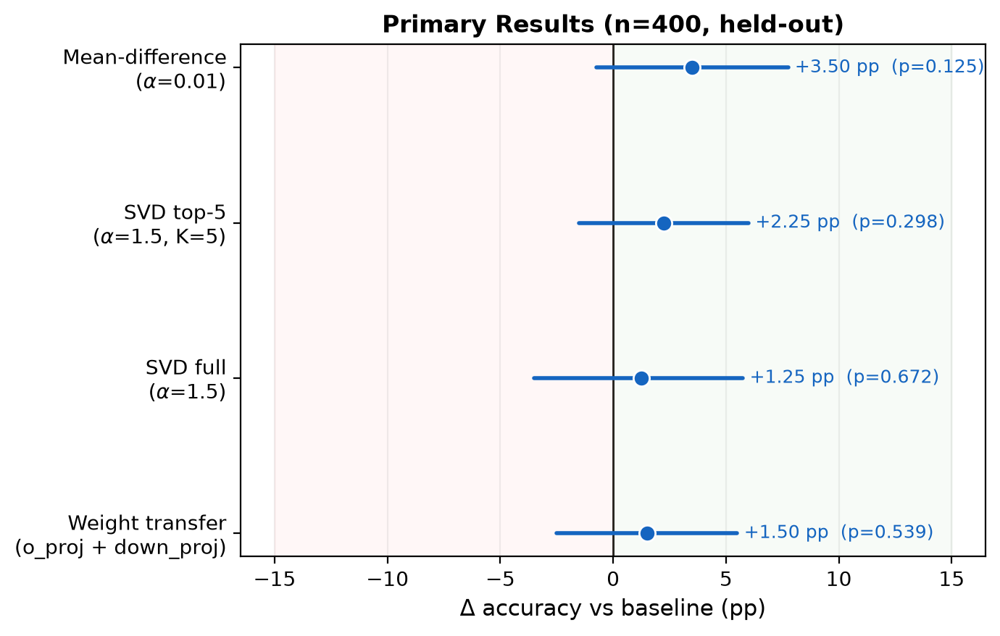
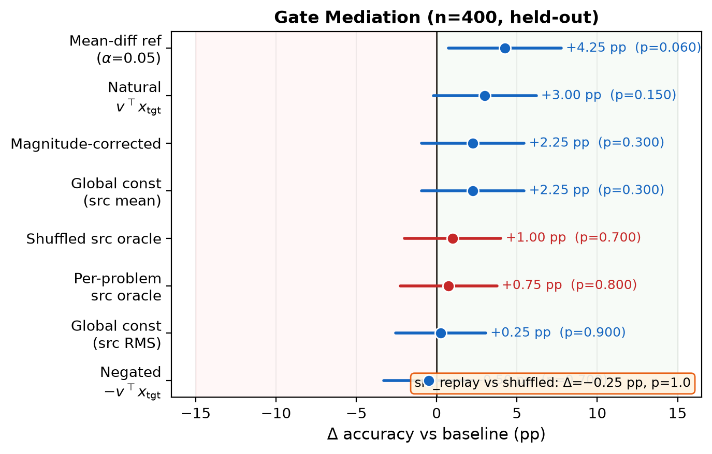
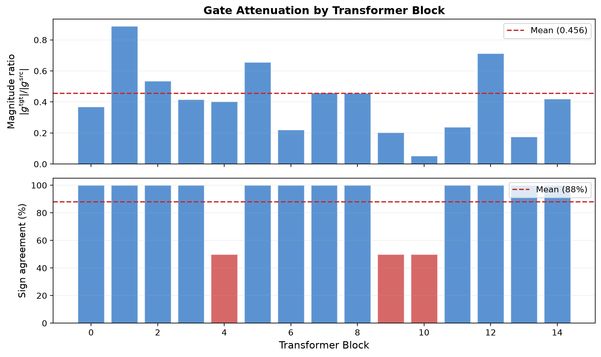
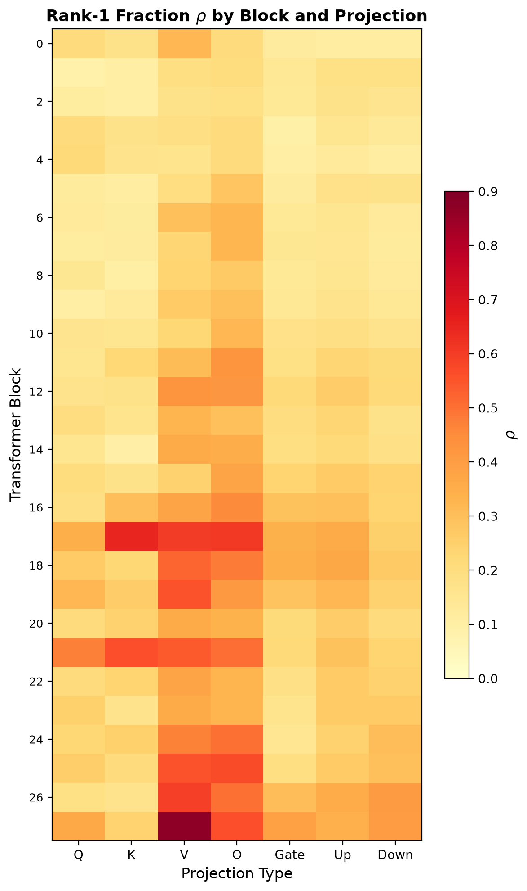
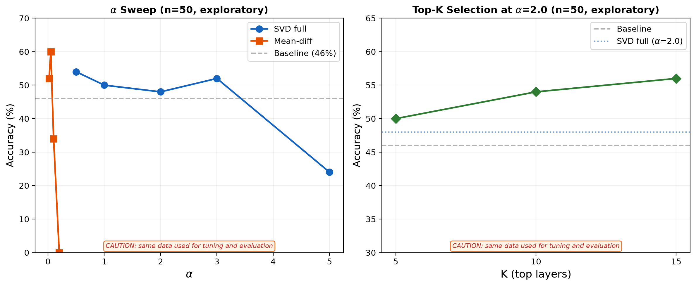

# From Weight Deltas to Steering Vectors: An Empirical Study of Cross-Model RLVR Transfer

**Subrahmanyam Arunachalam**

---

## Abstract

Reinforcement Learning with Verifiable Rewards (RLVR) can substantially improve the mathematical reasoning performance of large language models. Recent work shows that some of these improvements are concentrated in low-rank weight updates, which raises a natural question: can we extract these updates and transfer them to another model without retraining it? We study this question using Qwen2.5-1.5B models. First, we show that a rank-1 weight update has two parts: an output direction $u$ and an input-dependent scale $v^T x$ (Proposition 1). Next, we compare this scale in the source and target models. Its magnitude in the target is, on average, 45.6% of its magnitude in the source, and its sign differs in 12.0% of the projection-problem comparisons. However, replacing the target scales with source-derived scales performs no better than shuffling the source scales across problems. Thus, this simple scale mismatch does not explain the transfer behavior. Finally, we use the output directions obtained from Singular Value Decomposition (SVD) as residual-stream steering vectors. On a disjoint 400-problem MATH500 evaluation partition, SVD steering improves accuracy by 2.25 percentage points, but the difference is not statistically significant (exact McNemar $p=0.298$). Our results provide a framework for studying low-rank RLVR transfer, while showing that reliable cross-model improvement remains an open problem.

---

## 1. Introduction

Large language models (LLMs) have demonstrated improved mathematical benchmark performance after Reinforcement Learning with Verifiable Rewards (RLVR) [1, 2]. A striking observation from recent work [3] is that dominant low-rank components of some RLVR weight deltas preserve much of the measured benchmark gain. This suggests an appealing geometric picture: at least for some checkpoints, a behaviorally important part of the update may lie along only a few directions. Whether those directions encode a portable "reasoning skill," rather than checkpoint-specific structure, remains unresolved.

This observation raises a natural question: *Can we extract these reasoning directions and transplant them into other models?* If successful, this would enable "reasoning injection" without the computational cost of RL training for each target model.

In this paper, we investigate this question through formal analysis and empirical study. Our contributions are:

1. **Spectral characterization:** Reproducing and extending the analysis of [3], we find substantial matrix-wise spectral concentration in one RLVR checkpoint. Across 198 parameter matrices—196 inside 28 transformer blocks plus the embedding and language-model head—the leading singular component contains a mean 25.8% of weight-delta energy. Depending on matrix shape, this is 39–173× the leading-component fraction of shape-matched i.i.d. Gaussian matrices.

2. **Low-rank forward identity:** We show that applying a rank-1 weight delta to a linear layer is equivalent to input-conditional activation steering (Proposition 1), where the steering magnitude depends on alignment between the input and a learned "trigger direction." This is a local, per-layer identity; SVD-derived steering at the residual stream is a heuristic *motivated by* this identity but is not equivalent to it.

3. **Cross-model gate analysis:** We characterize prompt-level gate differences across 56 paired `o_proj`/`down_proj` projections. Target gate magnitudes average 45.6% of source magnitudes (median 41.5%), and the mean sign-disagreement rate across projection-problem pairs is 12.0%. A controlled comparison of matched and shuffled source prompt-average gates finds no difference (47.0% vs. 47.25%; direct McNemar $p=1.0$), limiting the explanatory power of these coarse gate statistics.

4. **SVD-derived steering evaluation:** We study a heuristic that orients left singular vectors using source-base calibration activations and applies their weighted combinations to the target residual stream. On the disjoint 400-problem evaluation partition, validation-selected top-5 steering yields a non-significant +2.25 pp change ($p=0.298$). This is a directional result that motivates replication, not a confirmed improvement.

---

## 2. Related Work

**RLVR for reasoning.** DeepSeek-R1 [1] and subsequent work [2, 4] demonstrated that reinforcement learning with verifiable rewards (correct/incorrect on math problems) can dramatically improve LLM reasoning. The One-Shot RLVR paper [3] showed that even a single training problem suffices, and that the learned capability is spectrally concentrated in low-rank weight updates.

**Model merging and weight interpolation.** Task arithmetic [5] and model merging techniques [6, 7] modify model weights by adding or interpolating weight deltas. These methods often work best when source and target share architecture and pretraining. Our work studies one local algebraic lens through which cross-model degradation can be analyzed.

**Activation steering.** Representation engineering [8] and steering vectors [9, 10] modify model behavior by adding fixed vectors to internal activations during inference. These methods have been applied to control style, truthfulness, and task behavior. At an individual linear projection, a low-rank weight update can be written as an input-dependent activation addition. Our post-block intervention is only heuristically related to that exact identity.

**Low-rank structure in fine-tuning.** LoRA [11] exploits low-dimensional parameterizations of fine-tuning updates. We measure the spectral concentration of one RLVR checkpoint, but do not claim that its concentration is unique to RLVR without comparisons to realistic fine-tuning deltas.

---

## 3. Problem Formulation

### 3.1 Setup

Consider two language models sharing the same architecture:
- **Source base model** with eligible parameter matrices $\{W_l^{\mathrm{src}}\}_{l=1}^{M}$
- **RLVR-trained model** with corresponding matrices $\{W_l^{\mathrm{rlvr}}\}_{l=1}^{M}$, obtained by applying RLVR to the source base

The weight delta for matrix $l$ is:
$$\Delta W_l = W_l^{\text{rlvr}} - W_l^{\text{src}}$$

We also have a **target model** with corresponding matrices $\{W_l^{\mathrm{tgt}}\}$ (different weights but the same architecture) to which we wish to transfer the update.

### 3.2 Spectral Decomposition

Applying SVD to each weight delta:
$$\Delta W_l = U_l \Sigma_l V_l^T = \sum_{i=1}^{r_l} \sigma_{l,i} \cdot u_{l,i} \cdot v_{l,i}^T$$

where $\sigma_{l,1} \geq \sigma_{l,2} \geq \cdots$ are the singular values, $u_{l,i}$ are left singular vectors (output directions), and $v_{l,i}$ are right singular vectors (input directions).

The **rank-1 fraction** for matrix $l$ is:
$$\rho_l = \frac{\sigma_{l,1}^2}{\sum_i \sigma_{l,i}^2} = \frac{\sigma_{l,1}^2}{\|\Delta W_l\|_F^2}$$

### 3.3 Transfer Objective

Given the rank-k approximation $\Delta \hat{W}_l = \sum_{i=1}^{k} \sigma_{l,i} \cdot u_{l,i} \cdot v_{l,i}^T$, the weight-space transfer operation applies:
$$W_l^{\text{transfer}} = W_l^{\text{tgt}} + \alpha \cdot \Delta \hat{W}_l$$

where $\alpha$ is a scaling hyperparameter. The goal is to improve reasoning performance of the target model through this modification.

---

## 4. Algebraic Lens: Low-Rank Forward Identity

### 4.1 Proposition

**Proposition 1** (Rank-1 weight modification as input-conditional activation steering). *For any linear layer with rank-1 weight modification $\Delta W_l = \sigma_1 u v^T$, the modified layer output on input $x$ satisfies:*

$$y^{\text{new}} = y^{\text{old}} + \sigma_1 \cdot (v^T x) \cdot u$$

*where $y^{\text{old}} = W_l x$. This is equivalent to adding an activation steering term with:*
- *Steering direction:* $u$ *(fixed, input-independent)*
- *Steering magnitude:* $\sigma_1 \cdot (v^T x)$ *(input-dependent, gated by alignment with* $v$*)*

**Derivation.** Direct computation:
$$y^{\text{new}} = (W_l + \sigma_1 u v^T) x = W_l x + \sigma_1 u (v^T x) = y^{\text{old}} + \sigma_1 (v^T x) u$$

where the last step uses $v^T x \in \mathbb{R}$. $\square$

**Scope.** This identity applies to a single linear projection in isolation. The primary cross-model experiments derive vectors from 56 `o_proj` and `down_proj` matrices, combine them per block, and inject the results at the post-block residual stream. SVD residual steering is therefore a *heuristic motivated by* Proposition 1, not equivalent to it.

### 4.2 Interpretation

Proposition 1 reveals that rank-1 weight modification implements a specific form of activation steering with an important structural property: the steering is **conditional on the input**. The scalar $g(x) = v^T x$ acts as a gating function:

- When $g(x) \gg 0$: strong forward steering in direction $u$
- When $g(x) \approx 0$: no steering applied (input not "recognized")
- When $g(x) \ll 0$: reverse steering in direction $-u$

Intuitively, $v$ acts as a **learned input detector**. It measures how strongly the current input aligns with $v$, and this value controls how much of the direction $u$ is added to the output. However, our experiments do not show that $v$ detects reasoning specifically; it may also capture general activation statistics.

### 4.3 Cross-Model Transfer: A Gate-Mismatch Hypothesis

**Hypothesis 1 (Gate Mismatch).** *If the goal is to reproduce the source model's local rank-1 perturbation in the target, a sufficient local condition is:*
$$v^T x^{\text{tgt}} \approx v^T x^{\text{src}}$$

*for typical inputs representing the same mathematical problems processed by source and target models respectively. When this condition fails, the local steering coefficient differs between models.*

This condition is neither necessary nor sufficient for behavioral transfer: scaling may compensate for different gates, while equal gates do not ensure that $u$ has the same functional effect or that downstream layers respond similarly. We therefore test gate mismatch as one possible factor rather than as a complete explanation.

---

## 5. Empirical Analysis

### 5.1 Experimental Setup

**Models.** We use:
- Source base: Qwen2.5-Math-1.5B
- Source RLVR: One-Shot-RLVR-Qwen2.5-Math-1.5B (trained on single problem with RLVR [3])
- Target: Qwen2.5-1.5B-Instruct (same architecture, different training)

**Evaluation.** We measure symbolic-equivalence accuracy on MATH500 [12] using greedy decoding, `max_new_tokens=1024`, batch size 1, and `math-verify` for answer equivalence. We use two-sided exact McNemar tests for paired correctness and paired bootstrap intervals (10,000 resamples, seed 42) for accuracy differences.

**Data splits.** The canonical evaluation uses three disjoint partitions of MATH500:
- **Calibration** (problems 450–499, n=50): orient SVD vector signs and compute mean-difference vectors
- **Validation** (problems 400–449, n=50): select steering strength $\alpha$ and layer count $K$
- **Test** (problems 0–399, n=400): single final evaluation per method; reported in all main tables

**Methodology.** For each parameter matrix $l$, we extract $u_l, \sigma_l, v_l$ from $\text{SVD}(\Delta W_l)$. We collect input activations $x_l$ on calibration problems from both source and target models, computing $v_l^T x_l^{\text{src}}$ and $v_l^T x_l^{\text{tgt}}$.

**Sign disambiguation.** SVD singular vectors have an inherent sign ambiguity: $(u, v)$ and $(-u, -v)$ represent the same weight delta. For steering purposes, discarding $v$ makes the sign of $u$ undetermined. We resolve this using **source-gate orientation**: for each projection $m$ in layer $l$, we orient $u_{l,m}$ using calibration activations from the source base model:
$$\tilde{u}_{l,m} = \operatorname{sign}\!\left(\mathbb{E}[v_{l,m}^T x_{\text{src}}]\right) \cdot u_{l,m}$$
This orientation is applied to each $u_{l,m}$ **individually before combining** across projections. It requires a single calibration pass on the source base model (not the RLVR model). We compare this to a weight-only orientation rule (largest-magnitude coordinate positive, no data required) and a mean-difference orientation (requires both source base and RLVR inference) as ablation baselines in `comprehensive_suite.py`.

### 5.2 Spectral Concentration

Across 198 parameter matrices (196 within 28 transformer blocks, plus the embedding and language-model head):
- Mean rank-1 fraction: $\bar{\rho} = 0.258$ (shape-matched i.i.d. Gaussian references have means of $\approx 0.001$–$0.007$, giving ratios of **39–173×** depending on matrix shape; see `outputs/spectral_null.json`)
- Maximum: $\rho_{\max} = 0.871$ (attention V-projection in layer 27)
- Matrices with $\rho > 0.3$: 57/198 (29%)

These spectral statistics establish concentration relative to an isotropic Gaussian reference, not that the dominant component uniquely encodes reasoning or that such concentration is specific to RLVR. Comparisons with other fine-tuning deltas remain future work.

### 5.3 Gating Signal Analysis

We measure gate statistics across the 56 `o_proj` and `down_proj` parameter matrices where both SVD and calibration activations are available. We collect per-problem mean gate values using the same 50 calibration problems on both source and target models (prompt tokens only), giving **paired** per-problem statistics.

| Metric | Value |
|--------|-------|
| Unweighted mean across 56 projections of $\mathbb{E}_{p}|g^{\text{tgt}}_{l,p}|/\mathbb{E}_{p}|g^{\text{src}}_{l,p}|$ | **0.456** |
| Median ratio | 0.415 |
| Fraction of projections with ratio < 0.5 | 66.1% |
| Mean paired prompt-level sign agreement | **88.0%** (12.0% sign disagreement) |

These values are from `outputs/gate_analysis.json`, measured on 56 `o_proj`/`down_proj` matrices using 50 paired calibration problems (prompt tokens only).

Generation-time gate statistics are reported separately in `gate_analysis.json` as an unpaired distribution (generated sequences differ between models).

### 5.4 Weight Transfer vs. Activation Steering

The clean comparison appears in Table 1 (Section 7.1). Full weight transfer on the 56 `o_proj`/`down_proj` matrices scores 47.75%, a +1.50 pp change from baseline (paired 95% CI [−2.50, 5.50], McNemar $p=0.539$). Because weight transfer, SVD residual steering, and mean-difference steering differ in intervention rank, location, normalization, and conditioning, their accuracies should not be interpreted as a controlled test of Proposition 1.

---

## 6. SVD-Derived Activation Steering

### 6.1 Method

Our analysis suggests a natural approach: extract the steering component $u_l$ from the RLVR weight delta and apply it directly as an activation steering vector, bypassing the gating mechanism $v^T x$.

For each transformer block $l$, we:
1. Compute $\Delta W_{l,m}$ for projection $m \in \{\text{o\_proj}, \text{down\_proj}\}$
2. Extract the dominant left singular vector $u_{l,m}$ and singular value $\sigma_{l,m}$ from each
3. Resolve sign ambiguity by orienting each $u_{l,m}$ individually using $\operatorname{sign}(\mathbb{E}[v_{l,m}^T x_{\text{src}}])$ on source base model calibration inputs ("source-gate orientation"; requires one calibration pass on the source base model)
4. Combine into a per-block steering vector: $s_l = \frac{\sum_m \sigma_{l,m} u_{l,m}}{\|\sum_m \sigma_{l,m} u_{l,m}\|}$
5. At inference, apply to the residual stream after transformer block $l$:

$$h_l' = h_l + \alpha \cdot w_l \cdot s_l$$

where $w_l = \sigma_l / \sigma_{\max}$ is the normalized importance weight, and $\sigma_l = \sum_m \sigma_{l,m}$.

**Sign ambiguity note.** Each $u_{l,m}$ must be individually oriented *before* summation, since $(u, v)$ and $(-u, -v)$ represent identical weight deltas — discarding $v$ leaves $u$'s sign undetermined. We use:
$$\tilde{u}_{l,m} = \operatorname{sign}\!\left(\mathbb{E}[v_{l,m}^T x]\right) \cdot u_{l,m}$$
where $x$ is the input to projection $m$ on source-model calibration examples ("source-gate orientation"). Steps 1–2 require only the weight delta; step 3 requires one calibration pass on the source base model only (not the RLVR model). We compare this to a weight-only rule (no calibration) and to mean-difference orientation in ablations (`comprehensive_suite.py`).

### 6.2 Variants

**Sigma-weighted (full).** Apply to all $L$ blocks with importance weighting $w_l$.

**Top-K sparse.** Apply only to the $K$ blocks with largest $\sigma_l$, reducing interference from low-importance blocks. $K$ is selected on the validation split.

### 6.3 Comparison with Mean-Difference Steering

Standard mean-difference steering computes:
$$s_l^{\text{diff}} = \mathbb{E}_{x \sim \mathcal{D}}[h_l^{\text{rlvr}}(x)] - \mathbb{E}_{x \sim \mathcal{D}}[h_l^{\text{src}}(x)]$$

This requires running inference on *both* the source base and RLVR models on calibration data. Our SVD approach requires the weight delta $\Delta W_l = W^{\text{rlvr}}_l - W^{\text{src}}_l$ plus a single calibration pass for sign orientation (vs. two full forward passes for mean-diff). Both methods need calibration data; SVD requires less computation from it.

---

## 7. Experiments

### 7.1 Clean Disjoint Evaluation

**Table 1.** Primary results on the disjoint TEST partition (n=400, problems 0–399). Hyperparameters were selected on a separate VAL partition (n=50, problems 400–449). The baseline is unmodified Qwen2.5-1.5B-Instruct.

| Method | Accuracy | Δ vs baseline | Paired Δ 95% CI | McNemar *p* |
|--------|----------|---------------|-----------------|-------------|
| Baseline | 46.25% | — | — | — |
| Weight transfer (`o_proj` + `down_proj`) | 47.75% | +1.50 pp | [−2.50, 5.50] | 0.539 |
| SVD full ($\alpha=1.5$) | 47.50% | +1.25 pp | [−3.50, 5.75] | 0.672 |
| SVD top-5 ($\alpha=1.5$, $K=5$) | 48.50% | +2.25 pp | [−1.50, 6.00] | 0.298 |
| Mean-difference ($\alpha=0.01$) | **49.75%** | **+3.50 pp** | [−0.75, 7.75] | 0.125 |

None of the observed improvements reaches conventional significance, and every paired bootstrap interval includes zero. Item-level predictions sufficient to reproduce these statistics are included in the released artifacts.

### 7.2 Interpretation

**Directional, not confirmatory, evidence.** Both SVD configurations move accuracy in a positive direction, but the data are compatible with no effect. We therefore do not claim that SVD steering reliably improves the target model.

**Mean-difference is the stronger baseline in this experiment.** It has the largest observed effect (+3.50 pp), although that result is also non-significant. This suggests that a calibration-derived residual direction may retain information not captured by the leading singular directions, but replication is required.

**Top-K selection remains unresolved.** Top-5 and top-20 tied on the 50-example validation split. Python's deterministic first-maximum tie-break selected $K=5$. The test result does not establish that singular values are a generally useful causal importance ranking.

**Small-sample selection bias.** During method development, tuning and evaluation on the same 50 examples produced apparent gains of +8 to +14 pp (Appendix C.3). Under the disjoint protocol, those estimates fall to +1.25 to +3.50 pp. We retain the earlier sweeps in Appendix C as a cautionary record, not as evidence for the method.

### 7.3 Practical Comparison

| Property | Mean-diff | SVD-derived |
|----------|-----------|-------------|
| Requires source model inference for vectors | Source base + RLVR | Source base only |
| Requires calibration data | Yes | Yes (sign orientation) |
| Construction | Difference of empirical residual means | SVD of checkpoint weight deltas |
| Structural provenance | Activation-derived direction | Traceable to specific matrices and singular components |
| Layer weighting | Uniform | Singular-value weighting |
| Clean test accuracy | **49.75%** | **48.50%** |
| Evidence of improvement | Non-significant | Non-significant |

The SVD construction is structurally easier to trace back to particular matrices and singular components, but this does not by itself make the directions semantically interpretable. Alpha robustness is left unranked because a canonical comparison has not yet been run.

---

## 8. Gate Mediation Experiment

To test whether coarse gate summaries contribute to transfer behavior, we keep steering directions, singular values, and projection locations fixed while varying the gate construction across seven conditions. Expected amplitude is approximately matched using calibration-set mean $|\sigma \cdot g|$. The shuffled condition uses the same source prompt-average values as `src_replay`, permuted across problems, making `src_replay` versus `shuffled` the cleanest contrast in this experiment.

**Table 2.** Gate mediation results on TEST (n=400). The natural condition's $\alpha$ was selected on VAL and then held fixed across gate conditions after calibration-based amplitude scaling.

| Condition | Gate used | Accuracy | Δ vs baseline |
|-----------|-----------|----------|---------------|
| Baseline | — | 46.25% | — |
| Natural | $v^T x_{\text{tgt}}$ (rank-1 projection-equivalent gate) | 49.25% | +3.00 pp |
| Magnitude-corrected | $(v^T x_{\text{tgt}}) \cdot c_l$ | 48.50% | +2.25 pp |
| Global-constant src mean | $\mathbb{E}[v^T x_{\text{src}}]$ | 48.50% | +2.25 pp |
| Per-problem src oracle | source prompt-average gate for problem $i$ | 47.00% | +0.75 pp |
| Shuffled src oracle | source prompt-average gate for problem $\text{perm}(i)$ | 47.25% | +1.00 pp |
| Global-constant src RMS | $\text{rms}(v^T x_{\text{src}})$ | 46.50% | +0.25 pp |
| Negated | $-(v^T x_{\text{tgt}})$ | 45.75% | −0.50 pp |
| Mean-difference reference ($\alpha=0.05$) | Residual-stream vector | 50.50% | +4.25 pp |

**Interpretation.** The key contrast is `src_replay` (47.00%) versus `shuffled` (47.25%). A direct paired exact McNemar test gives $p=1.0$, providing no evidence that matching source prompt-average gates to the corresponding problem helps relative to permuting those same values. This contrast uses one scalar per active projection per problem, held constant during generation; it does not replay token-level source trajectories. The differences among the remaining conditions are also non-significant relative to baseline. The mean-difference reference uses $\alpha=0.05$ rather than the main table's validation-selected $\alpha=0.01$ and is included only for context, not cross-table comparison. Causal claims are limited to the coarse gate summaries and 15-block rank-1 intervention tested here.

We also ran random-direction, random-sign, wrong-layer, and random-layer controls under an earlier 512-token generation protocol. Because that protocol produced a materially different baseline from the canonical 1024-token evaluation, those controls are excluded from the paper's evidentiary tables and must be rerun before supporting structural or layer-ranking claims.

---

## 9. Discussion

### 9.1 Why Does the Gating Mechanism Degrade?

The coefficient $v^T x$ changes when the same vector is applied to target-model activations. Possible contributors include:

1. **Representation divergence:** Different training curricula can produce different activation statistics, even for architecturally identical models
2. **Coupled input and output directions:** A rank-1 update jointly specifies both $v$ and $u$
3. **Non-linear accumulation:** Perturbations at earlier projections alter the inputs seen by later projections

One useful working hypothesis is that RLVR couples **what to change** with **when to express the change**: $u$ specifies a local output direction, while $v$ responds to the source model's internal representation of the current input. If the target organizes similar inputs differently, the same $v$ can produce a different coefficient even before downstream effects are considered. Our measured gate shifts are compatible with this picture, but they do not show that $v$ specifically detects inputs that benefit from reasoning.

The mediation experiment further shows that the simple version of this explanation is incomplete: replacing target gates with problem-matched source prompt averages does not help relative to shuffling those averages. A complete analysis would require token-aligned replay, matched interventions at identical projections, and measurements of how target downstream layers respond to each perturbation.

### 9.2 Implications for Model Merging

The local identity also applies algebraically to low-rank adapters and task vectors [5]. Whether gate mismatch materially affects those methods is unknown; experiments on model merging and representation alignment are future work.

### 9.3 Limitations

- **Scale:** Experiments are on 1.5B-parameter models within the Qwen2.5 family; larger models and cross-family transfer (e.g., Llama → Qwen) remain unexplored
- **Statistical power:** The n=400 results are directionally positive but non-significant, and their paired intervals include zero
- **Single RLVR source:** We use one RLVR-trained model; results may vary with different training examples, seeds, or RLVR algorithms
- **Evaluation coverage:** MATH500 tests mathematical reasoning specifically; it is unclear whether gains reflect general reasoning improvement or math-domain formatting behavior
- **Control coverage:** Random and layer-permutation controls must be rerun under the canonical generation protocol
- **Gating hypothesis incompleteness:** Prompt-average source replay and shuffled replay are indistinguishable, and token-level source trajectories remain untested

---

## 10. Conclusion

We study a local algebraic connection between rank-1 weight updates and input-dependent activation additions. For one RLVR checkpoint, weight deltas are substantially more rank-concentrated than shape-matched i.i.d. Gaussian matrices. Across 56 projections, target prompt-level gate magnitudes average 45.6% of source magnitudes, with a 12.0% mean sign-disagreement rate over projection-problem comparisons.

Clean n=400 evaluation shows modest directional differences: SVD top-5 changes accuracy by +2.25 pp and mean-difference steering by +3.50 pp over the 46.25% baseline, with McNemar p-values of 0.298 and 0.125. Neither result establishes an improvement. Replacing target gates with matched source prompt-average gates also does not outperform shuffled replay (47.0% vs. 47.25%, direct $p=1.0$).

SVD-derived steering extracts left singular directions from weight deltas, orients them with one source-base calibration pass, and applies weighted combinations to the target residual stream. The most defensible contribution is an exploratory framework: an algebraic lens on low-rank updates, a careful account of sign ambiguity, and a clean evaluation with item-level paired statistics. Establishing a reliable transfer method will require canonical null controls, independent RLVR runs, additional targets, and broader benchmarks.

---

## References

[1] DeepSeek-AI. DeepSeek-R1: Incentivizing reasoning capability in LLMs via reinforcement learning. *arXiv preprint arXiv:2501.12948*, 2025.

[2] Cui, G., et al. Process reinforcement through implicit rewards. *arXiv preprint arXiv:2502.01456*, 2025.

[3] Wang, Y., et al. Reinforcement learning for reasoning in large language models with one training example. *NeurIPS*, 2025. arXiv:2504.20571.

[4] Shao, Z., et al. DeepSeekMath: Pushing the limits of mathematical reasoning in open language models. *arXiv preprint arXiv:2402.03300*, 2024.

[5] Ilharco, G., et al. Editing models with task arithmetic. *ICLR*, 2023.

[6] Yadav, P., et al. TIES-merging: Resolving interference when merging models. *NeurIPS*, 2023.

[7] Wortsman, M., et al. Model soups: averaging weights of multiple fine-tuned models improves accuracy without increasing inference time. *ICML*, 2022.

[8] Zou, A., et al. Representation engineering: A top-down approach to AI transparency. *arXiv preprint arXiv:2310.01405*, 2023.

[9] Turner, A., et al. Activation addition: Steering language models without optimization. *arXiv preprint arXiv:2308.10248*, 2023.

[10] Li, K., et al. Inference-time intervention: Eliciting truthful answers from a language model. *NeurIPS*, 2023.

[11] Hu, E., et al. LoRA: Low-rank adaptation of large language models. *ICLR*, 2022.

[12] Hendrycks, D., et al. Measuring mathematical problem solving with the MATH dataset. *NeurIPS*, 2021.

---

## Appendix A: Detailed Spectral Analysis

The rank-1 fraction distribution across 198 parameter matrices shows substantial heterogeneity. Attention V-projections have the highest mean concentration in this checkpoint (mean ρ ≈ 0.42), followed by K- and O-projections. MLP matrices have lower concentration but remain above the shape-matched i.i.d. Gaussian reference. This comparison does not establish that the structure is specific to RLVR; realistic fine-tuning-delta controls remain future work.

The top 5 parameter matrices by rank-1 fraction are all attention projections:
1. `model.layers.27.self_attn.v_proj.weight` — ρ = 0.871
2. `model.layers.17.self_attn.k_proj.weight` — ρ = 0.650
3. `model.layers.17.self_attn.o_proj.weight` — ρ = 0.606
4. `model.layers.17.self_attn.v_proj.weight` — ρ = 0.601
5. `model.layers.26.self_attn.v_proj.weight` — ρ = 0.594

These values are from `outputs/spectral_data.json` (198 entries, 196 with `layer_idx ≥ 0`).

## Appendix B: Clean Evaluation Artifacts

The primary results in Table 1 use:
- Calibration: MATH500 problems 450–499
- Validation: problems 400–449
- Test: problems 0–399
- Greedy decoding with `max_new_tokens=1024` and batch size 1
- Symbolic answer equivalence through `math-verify`

Canonical item-level artifacts are:
- `outputs/items_baseline_test.json`
- `outputs/items_test_svd_full_a1.5.json`
- `outputs/items_test_svd_top5_a1.5.json`
- `outputs/items_test_meandiff_a0.01.json`
- `outputs/items_scope_weight_transfer.json`

These files contain predictions and per-item correctness used for exact McNemar tests. Only the artifacts listed above are used for the primary behavioral results.

## Appendix C: Pilot Experiments Excluded from Main Claims

The experiments in this appendix were conducted during method development with earlier evaluators or with calibration and evaluation overlap. They are documented for transparency but are not used as evidence in the main paper.

### C.1 Same-Model Rank-1 Reconstruction

On the first 100 MATH500 problems, using the earlier evaluator:

| Method | Accuracy | n |
|--------|----------|---|
| Source base (Qwen2.5-Math-1.5B) | 34% | 100 |
| + rank-1 weight reconstruction ($\alpha=1.0$) | 65% | 100 |
| Full RLVR model | 72% | 100 |

This corresponds to $\frac{65-34}{72-34}=81.6\%$ of the measured improvement on that subset. The result should be rerun with the canonical evaluator before being treated as confirmatory.

### C.2 Recalibrated Weight Transfer

On a 50-problem development subset:

| Method | Accuracy |
|--------|----------|
| Subset baseline | 46% |
| Per-layer gate scaling | 50% |
| Target-direction replacement | 42% |

Calibration and evaluation overlapped, so these values serve only as motivation for the clean gate-mediation experiment.

### C.3 Exploratory Alpha Sweeps

### Weight Transfer (n=100)
| $\alpha$ | 0.5 | 1.0 | 1.5 | 2.0 |
|----------|-----|-----|-----|-----|
| Accuracy | 44% | 47% | 49% | 50% |

### SVD Steering — Residual Stream (n=50, problems 0–49)
| $\alpha$ | 0.5 | 1.0 | 2.0 | 3.0 | 5.0 |
|----------|-----|-----|-----|-----|-----|
| Accuracy | 54% | 50% | 48% | 52% | 24% |

### Mean-Diff Steering — Residual Stream (n=50, problems 0–49)
| $\alpha$ | 0.02 | 0.05 | 0.1 | 0.2 |
|----------|------|------|-----|-----|
| Accuracy | 52% | 60% | 34% | 0% |

The steering sweeps use problems 0–49 for both method development and evaluation and are not evidence for the final method.

## Appendix D: Pilot Hook-Placement Comparison

An early pilot experiment suggested that hook placement materially affects results:

| Hook placement | Best accuracy | Best Δ (pp) |
|---------------|--------------|-------------|
| o\_proj/down\_proj output | 48% | +2 |
| Residual stream (after full transformer block) | 54% | +8 |

Because this comparison used the exploratory protocol, it motivates a future matched-location ablation but does not establish that residual-stream injection is generally superior.
